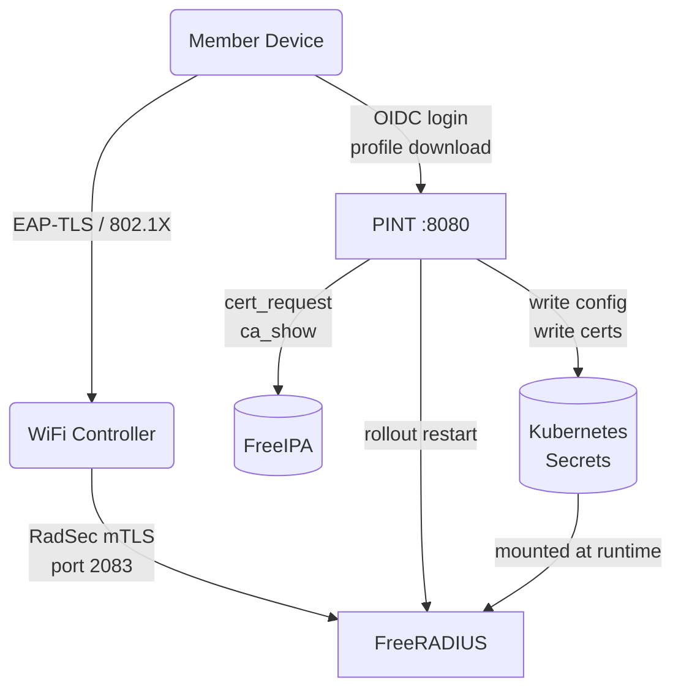
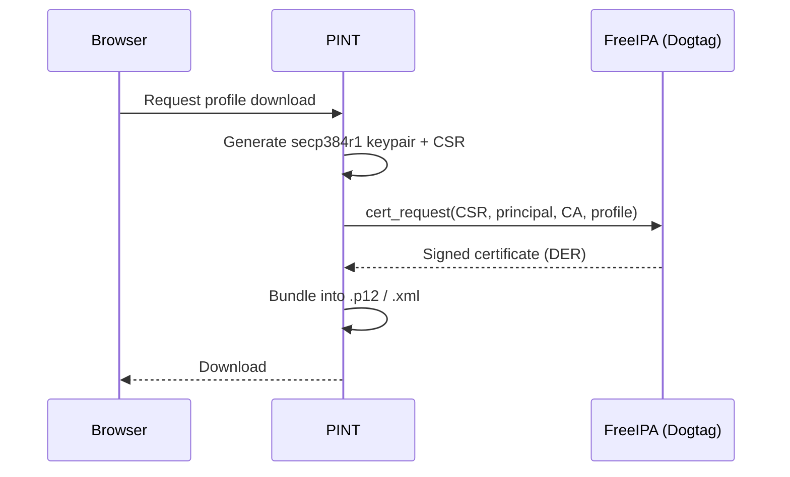
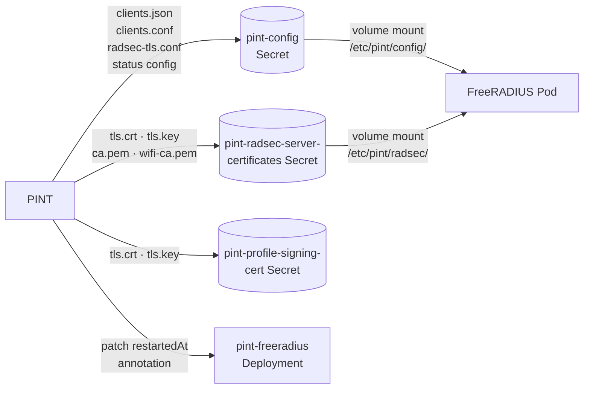
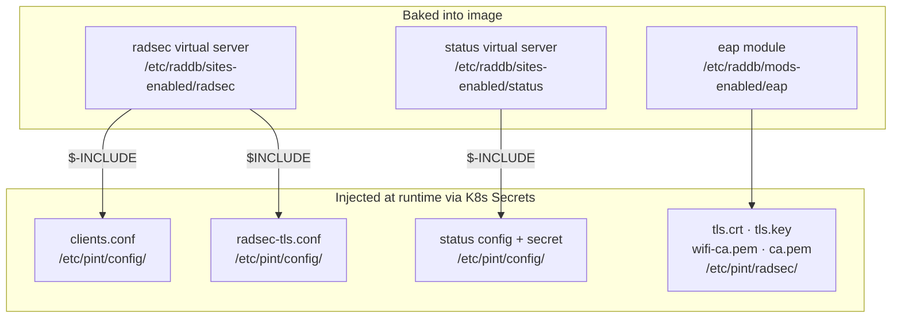
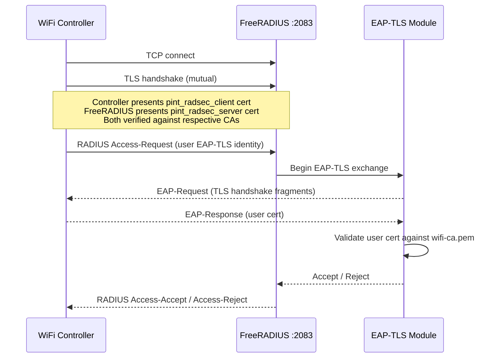

# PINT: Pouring IPA for Network Trust

PINT is a self-service WiFi enrollment portal for [Computer Science House](https://csh.rit.edu). Members log in with their CSH Keycloak account and PINT issues them a certificate from FreeIPA. That certificate is used to authenticate to the WiFi network via EAP-TLS, with no passwords involved. WiFi controllers (home routers, etc.) can also enroll for a RadSec client certificate to proxy authentication back to FreeRADIUS over a mutual-TLS connection.

PINT is a single stateless Go binary. There is no database. All persistent state lives in Kubernetes Secrets that FreeRADIUS mounts directly.



---

## PINT

### Certificate Generation via FreeIPA

PINT uses two distinct paths to issue WiFi client certificates depending on the platform.

**iOS and macOS &mdash; SCEP (on-device key generation)**

PINT acts as a SCEP Registration Authority. The device generates its own RSA 2048 keypair locally and enrolls through the `/scep` endpoint embedded in the mobileconfig. The private key never leaves the device, and iOS handles automatic renewal before the certificate expires.

```mermaid
sequenceDiagram
    participant iOS as iOS / macOS Device
    participant P as PINT
    participant IPA as FreeIPA (Dogtag)

    iOS->>P: Download profile (authenticated)
    P->>P: Issue one-time SCEP challenge
    P-->>iOS: Mobileconfig with SCEP payload + challenge
    note over iOS: Device generates RSA 2048 keypair on-device
    iOS->>P: SCEP PKIOperation (CSR + challenge, CMS-wrapped)
    P->>P: Validate challenge; extract username
    P->>IPA: cert_request(CSR, username, pint_wifi)
    IPA-->>P: Signed certificate (DER)
    P-->>iOS: CMS-wrapped certificate response
    note over iOS: Certificate installed; WiFi connects
    note over iOS,P: Near expiry: iOS re-runs SCEP automatically
```

The SCEP Registration Authority (RA) uses a self-signed RSA 2048 certificate (CN `CSH PINT SCEP RA`) stored in the `pint-scep-ra-cert` Kubernetes Secret. PINT generates this automatically on first startup if the Secret does not exist. It is intentionally self-signed and set to never expire. The RA cert is not a trust anchor; it is only used to encrypt the CMS envelope during the SCEP exchange. iOS identifies it via the SHA-1 fingerprint embedded in the mobileconfig's SCEP payload.

**All other platforms &mdash; server-side key generation**

For Android, Windows, and Linux, PINT generates a secp384r1 ECDSA keypair, submits the CSR to FreeIPA's `cert_request` RPC, and bundles the result into a PKCS#12 archive for download. The private key is shown once and never stored.



PINT authenticates to FreeIPA using a service account specified by `PINT_IPA_SERVICE_ACCOUNT` and `PINT_IPA_PASSWORD`. The session is established at startup and re-authenticated automatically on 401.

#### Profiles

Three custom Dogtag certificate profiles control validity, key usage, and subject enforcement. All profiles force `O=CSH.RIT.EDU` in the issued certificate subject regardless of what the CSR contains.

| Profile | Purpose | Validity | Key | EKU |
|---|---|---|---|---|
| `pint_wifi` | EAP-TLS client certs for member devices | 1 year | RSA 2048 or EC | `clientAuth` |
| `pint_radsec_client` | mTLS client certs for WiFi controllers | 5 years | EC (secp384r1) | `clientAuth` |
| `pint_radsec_server` | mTLS server cert for the FreeRADIUS RadSec listener | 90 days | EC (secp384r1) | `serverAuth` |
| `pint_profile_signing` | CMS signing cert for iOS mobileconfig profiles | 1 year | EC (secp384r1) | `codeSigning` |

The `pint_wifi` profile accepts both RSA and EC keys because iOS generates RSA 2048 on-device via SCEP while other platforms submit EC keypairs generated by PINT. The 1-year validity is short enough to rotate credentials regularly while remaining transparent to users on iOS/macOS, where SCEP handles renewal automatically. The 90-day server cert and 1-year profile signing cert are also automatically renewed by PINT (see [RadSec Server Cert](#radsec-server-cert) and [Profile Signing Cert](#profile-signing-cert)).

Profile config files live in `ipa/profiles/`. They must be imported into FreeIPA once before PINT can use them. Use `ipa/update_profile.py`, which supports three actions:

| Action | FreeIPA call | When to use |
|---|---|---|
| `update` | `certprofile_mod` | Profile already exists; push changes |
| `show` | `certprofile_show` | Inspect what is currently deployed |
| `reimport` | `certprofile_del` + `certprofile_import` | Profile config is missing from FreeIPA (first import or after manual Dogtag changes) |

```bash
cd ipa
python3 update_profile.py
```

The corresponding environment variables (all optional; defaults shown):

```
PINT_IPA_CERT_PROFILE=pint_wifi
PINT_IPA_RADSEC_CLIENT_CERT_PROFILE=pint_radsec_client
PINT_IPA_RADSEC_SERVER_CERT_PROFILE=pint_radsec_server
PINT_IPA_CODE_SIGNING_CERT_PROFILE=pint_profile_signing
```

### WiFi Profile Generation

Members visit `/profile` and download a platform-specific package. PINT issues a fresh certificate on each download.

| Platform | Output | Contents |
|---|---|---|
| iOS / macOS | `.mobileconfig` (Apple Configuration Profile) | SCEP payload, WiFi CA, root CA, code-signing CA, 802.1X/EAP-TLS config; optionally CMS-signed |
| Android | `.p12` (PKCS#12) | Client cert + key + WiFi CA, imported via Android WiFi settings |
| Windows | `.xml` (WLAN profile) + `.p12` (PKCS#12) | EAP-TLS config and CA thumbprint; cert imported separately into the Windows certificate store |

The iOS mobileconfig always embeds the WiFi intermediate CA and root CA so the full trust chain is installed in one step. The SCEP payload instructs iOS to generate a keypair on-device, enroll with PINT's `/scep` endpoint using a one-time challenge, and renew automatically near expiry &mdash; users never need to re-download the profile. When `PINT_IPA_CODE_SIGNING_CA_NAME` is set, PINT also embeds the code-signing intermediate CA and wraps the profile in a CMS `SignedData` envelope, letting iOS display it as "Verified" after the CA profile is trusted.

### WiFi Controller Enrollment

Members running home routers or other WiFi controllers can enroll for a RadSec client certificate. This lets their equipment proxy 802.1X authentication requests back to FreeRADIUS over a mutual-TLS connection on port 2083.

**Enrollment:**
1. Member visits `/radius`, enters their controller's source IP, and clicks Enroll.
2. PINT generates a secp384r1 keypair and requests a `pint_radsec_client` certificate from FreeIPA.
3. The private key and certificate PEM are displayed **once**. PINT does not retain them.
4. PINT writes an updated `clients.conf` to the Kubernetes config Secret and triggers a FreeRADIUS rollout restart.
5. The member configures their router with the cert, key, and the RadSec CA chain (downloadable from `/radius/ca`). The RADIUS shared secret is always `radsec` (standard for RFC 6614).

**IP allowlist:** A source IP address is required at enrollment and when updating. Regular members must supply a single bare IP; CIDR ranges are rejected. Requests arriving from any other address are dropped by FreeRADIUS before authentication begins. Only the organisation-level controller (managed via `/admin/radius`) accepts a CIDR range or no restriction.

**Lifecycle:** Members can update their IP allowlist, regenerate credentials (revokes and replaces the cert), or delete their enrollment entirely at any time from `/radius`. Admins (RTP group) have the same controls over any member's enrollment via `/admin/radius`, and can provision an organisation-level controller (`root`) that is not tied to any member account.

### FreeRADIUS Control

PINT manages FreeRADIUS entirely through the Kubernetes API with no direct process communication.



**`pint-config` Secret:** PINT writes and owns all keys.

| Key | Description |
|---|---|
| `clients.json` | Enrolled controller list (PINT's source of truth) |
| `clients.conf` | FreeRADIUS client configuration rendered from `clients.json` |
| `radsec-tls.conf` | TLS block for the RadSec listener; CRL checking on/off via `PINT_RADIUS_RADSEC_CHECK_CRL` |
| `status` | Status virtual server client config |
| `status-secret` | Shared secret for status server queries |

**`pint-radsec-server-certificates` Secret:** TLS material for FreeRADIUS.

| Key | Description |
|---|---|
| `tls.crt` / `tls.key` | RadSec server certificate and private key |
| `ca.pem` | RadSec CA chain used to verify controller client certs |
| `wifi-ca.pem` | WiFi CA cert used to verify EAP-TLS user certs |

**`pint-profile-signing-cert` Secret:** CMS signing identity for iOS mobileconfig profiles. Only created when `PINT_IPA_CODE_SIGNING_CA_NAME` is set.

| Key | Description |
|---|---|
| `tls.crt` / `tls.key` | Profile signing certificate and private key |

When any config changes, PINT patches the FreeRADIUS Deployment's `kubectl.kubernetes.io/restartedAt` annotation, triggering a rolling restart that picks up the new Secret contents.

#### RadSec Server Cert

At startup, PINT checks whether the RadSec server certificate has more than 30 days of validity remaining. If the cert is missing or nearing expiry, PINT requests a new `pint_radsec_server` certificate from FreeIPA, writes it to the Secret, and triggers a FreeRADIUS restart. A background goroutine repeats this check every 24 hours, so renewals are fully automatic.

#### Profile Signing Cert

When `PINT_IPA_CODE_SIGNING_CA_NAME` is set, PINT manages a CMS signing certificate using the same pattern as the RadSec server cert. At startup it checks the `pint-profile-signing-cert` Secret; if the cert is missing or within 30 days of expiry, PINT requests a new `pint_profile_signing` certificate from FreeIPA and stores it. A background goroutine renews it daily as needed. Unlike the RadSec cert, a renewed profile signing cert takes effect on the next PINT restart (no FreeRADIUS reload is required).

The signature on a mobileconfig is only verified at installation time — existing installed profiles remain functional even if the signing cert later expires.

---

## FreeRADIUS

The FreeRADIUS image is built from `dev/freeradius/Dockerfile`. It contains the virtual server and module configuration that defines FreeRADIUS's behaviour; the runtime-variable parts (client lists, TLS config, certificate material) are injected by PINT via the Kubernetes Secrets described above.

### Configuration

Understanding what is baked into the image versus what PINT controls at runtime is key to debugging auth failures.



**`radsec` virtual server** listens on TCP port 2083. It `$INCLUDE`s `radsec-tls.conf` (the TLS block PINT generates, containing cert paths and CRL settings) and `$-INCLUDE`s `clients.conf` (the enrolled controller list). The `$-INCLUDE` variant is FreeRADIUS syntax for an optional include; the server starts even if the file is absent, which lets FreeRADIUS boot before PINT has written its first config.

**`status` virtual server** listens on UDP port 18121. It `$-INCLUDE`s the status client config written by PINT, which defines which CIDRs may query the status server and the shared secret required to do so.

**`eap` module** configures EAP-TLS as the only permitted EAP type. It references the cert files from the `pint-radsec-server-certificates` Secret directly: `tls.crt`, `tls.key`, and `wifi-ca.pem`. The same server certificate is used for both the RadSec listener TLS and EAP-TLS inner authentication.

### RadSec Server

RadSec is RADIUS-over-TLS (RFC 6614). Instead of UDP with a shared secret, controllers open a persistent TCP connection on port 2083 and authenticate with a mutual-TLS handshake. Once the TLS session is established, standard RADIUS packets flow over it.



Source IP allowlists are enforced in `clients.conf` before any authentication occurs. A controller arriving from an unexpected IP is silently dropped at the RADIUS layer.

### EAP Module

EAP-TLS is the only supported authentication method with no password fallback. During the EAP exchange, FreeRADIUS validates the user's client certificate against `wifi-ca.pem` (the WiFi intermediate CA). Only certificates issued through PINT's `pint_wifi` profile will pass, since that profile enforces `clientAuth` EKU and the CA is not publicly trusted.

TLS 1.2 is the minimum version. The cipher list is restricted to `ECDHE+AESGCM:DHE+AESGCM` with `secp384r1` as the negotiated ECDH curve, matching the EC keys in all PINT-issued certificates.

### Status Server

FreeRADIUS exposes a status virtual server on UDP port 18121. PINT queries each pod's status server directly (by pod IP, not through the Service) to surface per-pod statistics on the `/status` page: authentication counters, reject counts, and uptime. The shared secret is stored in `pint-config` under `status-secret`. PINT generates it once on first startup; subsequent restarts reuse the existing value.

---

## Deployment

### Helm Chart

The chart in `chart/` deploys both PINT and FreeRADIUS into a single namespace and wires up the Kubernetes RBAC, Secrets, ConfigMap, and Services they need.

Key values:

```yaml
# Container images; default tags come from Chart.appVersion
pint:
  image:
    repository: pint
    tag: ""

freeradius:
  image:
    repository: pint-freeradius
    tag: ""

# Non-sensitive config rendered into a ConfigMap
config:
  clientID: ""
  serverURL: ""
  ipaHost: ""
  ipaServiceAccount: ""
  wifiSSID: "CSH"
  radiusServer: ""
  # ... (see chart/values.yaml for full list)

# Pre-existing Secret with sensitive credentials (see below)
envSecret: ""

# OpenShift Route (disabled by default)
openshift:
  enabled: false
  route:
    host: ""
```

The FreeRADIUS Service defaults to `LoadBalancer` so port 2083 gets an external IP. In environments without a load balancer (like the dev kind cluster), set `freeradius.service.type=NodePort` and specify a `nodePort`.

To disable the in-cluster PINT deployment and run PINT locally instead (useful during development):

```yaml
pint:
  enabled: false
```

### Publishing

The chart is published to GitHub Pages via `helm/chart-releaser-action` on every push to `main` or `dev` that touches `chart/**`.

- **`main`**: releases the version declared in `chart/Chart.yaml` as a stable release.
- **`dev`**: stamps the version as `<version>-dev.<run_number>` (e.g. `0.1.0-dev.42`) and publishes a pre-release. Useful for testing chart changes before merging.

To add the Helm repository:

```bash
helm repo add pint https://computersciencehouse.github.io/pint
helm repo update
```

### Credentials Secret

All non-sensitive PINT configuration is rendered directly into the Deployment's `env` block from the `config:` values. Sensitive credentials must be provided in a pre-existing Secret:

```bash
kubectl create secret generic <release-name> -n pint \
  --from-literal=PINT_CLIENT_SECRET=<oidc-secret> \
  --from-literal=PINT_IPA_PASSWORD=<ipa-password>
```

Set `envSecret` in your values to the name of this Secret. The chart mounts it via `envFrom` on the PINT Deployment.

---

## Development

### Dependencies

| Tool | Purpose |
|---|---|
| Go 1.26+ | Build PINT and the FreeIPA stub |
| Docker | Build images |
| `kind` | Local Kubernetes cluster for FreeRADIUS |
| `helm` | Deploy the chart into kind |
| `kubectl` | Interact with the dev cluster |
| `overmind` | Run the Procfile (PINT + FreeIPA stub simultaneously) |
| `caddy` | HTTPS reverse proxy for local SCEP testing (iOS requires TLS) |

### Local Setup

```bash
# One-time: create the kind cluster, install the Helm chart,
# build the FreeRADIUS image, and install metrics-server.
# Safe to re-run; skips steps already complete.
make dev-setup

# Copy and edit the dev env file.
# The stub defaults work for all IPA_* fields out of the box.
cp .env.dev.example .env.dev

# Build both binaries and start everything.
make dev
```

`make dev` starts three processes via `overmind` and the `Procfile`:

- **`ipa-stub`**: FreeIPA stub server on `:8088` (see [FreeIPA Stub](#freeipa-stub) below).
- **`pint`**: the PINT server on `:8080`. It waits for the stub to be ready before starting.
- **`caddy`**: HTTPS reverse proxy from `https://localhost:8443` to `http://localhost:8080`. Only starts when `PINT_SERVER_URL=https://localhost:8443` (see [Testing SCEP Locally](#testing-scep-locally) below); otherwise it idles.

FreeRADIUS runs in the kind cluster and persists between `make dev` sessions. PINT talks to it via the Kubernetes API using your local `~/.kube/config`.

To access RTP-gated routes (`/status` reload button, `/admin/radius`) locally, set `PINT_DEV_RTP=true` in `.env.dev`.

**Other useful targets:**

```
make build           # compile pint binary
make build-stub      # compile freeipa-stub binary
make test            # go test ./... -v
make lint            # go vet ./...
make dev-logs        # stream FreeRADIUS logs from the kind cluster
make dev-forward     # port-forward RadSec to localhost:2083
make dev-metrics     # (re-)install metrics-server (enables CPU/memory on /status)
make docker-build    # build pint:dev Docker image
make clean           # remove binaries, kill stub process
```

### Configuration Reference

All configuration is via environment variables. Copy `.env.dev.example` to `.env.dev` to get started.

**Required:**

| Variable | Description |
|---|---|
| `PINT_CLIENT_ID` | Keycloak OIDC client ID |
| `PINT_CLIENT_SECRET` | Keycloak OIDC client secret |
| `PINT_SERVER_URL` | Public base URL (e.g. `https://pint.csh.rit.edu`) |
| `PINT_IPA_HOST` | FreeIPA hostname (e.g. `ipa.csh.rit.edu`) |
| `PINT_IPA_SERVICE_ACCOUNT` | FreeIPA service account DN (`krbprincipalname=pint/host@REALM,...`) |
| `PINT_IPA_PASSWORD` | FreeIPA service account password |
| `PINT_WIFI_SSID` | SSID embedded in generated WiFi profiles |
| `PINT_RADIUS_SERVER` | RadSec endpoint shown to users (e.g. `radius.csh.rit.edu:2083`) |

**Optional (defaults shown):**

| Variable | Default | Description |
|---|---|---|
| `PINT_IPA_WIRELESS_CA_NAME` | `wireless` | FreeIPA CA for WiFi client certs |
| `PINT_IPA_RADSEC_CA_NAME` | `radsec` | FreeIPA CA for RadSec certs |
| `PINT_IPA_ROOT_CA_NAME` | `ipa` | Root signing CA |
| `PINT_IPA_CERT_PROFILE` | `pint_wifi` | Dogtag profile for WiFi certs |
| `PINT_IPA_RADSEC_CLIENT_CERT_PROFILE` | `pint_radsec_client` | Dogtag profile for controller certs |
| `PINT_IPA_RADSEC_SERVER_CERT_PROFILE` | `pint_radsec_server` | Dogtag profile for the RadSec server cert |
| `PINT_IPA_CODE_SIGNING_CA_NAME` | _(unset)_ | FreeIPA intermediate CA for profile signing certs; enables iOS mobileconfig signing when set |
| `PINT_IPA_CODE_SIGNING_CERT_PROFILE` | `pint_profile_signing` | Dogtag profile for the profile signing cert |
| `PINT_PROFILE_SIGNING_CERT_SECRET` | `pint-profile-signing-cert` | K8s Secret for the profile signing cert and key |
| `PINT_NAMESPACE` | `pint` | Kubernetes namespace |
| `PINT_CONFIG_SECRET` | `pint-config` | K8s Secret for RADIUS config |
| `PINT_RADSEC_CERT_SECRET` | `pint-radsec-server-certificates` | K8s Secret for RadSec TLS material |
| `PINT_FREERADIUS_DEPLOYMENT` | `pint-freeradius` | FreeRADIUS Deployment name |
| `PINT_RADIUS_STATUS_PORT` | `18121` | FreeRADIUS status server port |
| `PINT_RADIUS_RADSEC_CHECK_CRL` | `true` | Enable CRL checking in the RadSec TLS listener |
| `PINT_RADIUS_RADSEC_PROXY_PROTOCOL` | `false` | Expect HAProxy PROXY protocol header on RadSec connections; set `true` when HAProxy fronts FreeRADIUS |
| `PINT_SCEP_RA_CERT_SECRET` | `pint-scep-ra-cert` | K8s Secret for the SCEP Registration Authority (RA) certificate and key; auto-generated on first startup |
| `PINT_IPA_SKIP_TLS_VERIFY` | `false` | Skip FreeIPA TLS verification (dev only) |
| `PINT_DISABLE_OIDC` | `false` | Bypass OIDC and inject a static dev user |
| `PINT_DEV_RTP` | `false` | Inject `rtp` group into dev user (requires `PINT_DISABLE_OIDC=true`) |

### Testing SCEP Locally

iOS requires HTTPS to complete SCEP enrollment, so local testing needs a TLS frontend. Caddy handles this automatically when you set `PINT_SERVER_URL` to the local HTTPS address in `.env.dev`:

```bash
# .env.dev
PINT_SERVER_URL=https://localhost:8443
PINT_DISABLE_OIDC=true   # skip OIDC so you can download profiles without a Keycloak session
```

With those two variables set, `make dev` will start Caddy alongside PINT. On first run, Caddy generates a local CA and certificate. Trust it system-wide so the iOS profile installer accepts the mobileconfig:

```bash
sudo security add-trusted-cert -d -r trustRoot \
  -k /Library/Keychains/System.keychain \
  "$HOME/Library/Application Support/Caddy/pki/authorities/local/root.crt"
```

After that, download a profile from `https://localhost:8443/profile`, install it on a device on the same network, and watch PINT's logs for the SCEP `PKIOperation` request and the resulting cert issuance. The SCEP Registration Authority (RA) certificate is auto-generated and stored in the `pint-scep-ra-cert` Kubernetes Secret on first startup; it persists across restarts.

### FreeIPA Stub

The stub (`dev/freeipa-stub/`) is a minimal HTTPS server that implements just enough of the FreeIPA JSON-RPC API for PINT to function locally. It runs on `:8088` with a self-signed TLS certificate, so `PINT_IPA_SKIP_TLS_VERIFY=true` must be set in `.env.dev`.

**CA structure**

On first run the stub generates a three-tier CA hierarchy and persists it to `dev/freeipa-stub/data/`:

```
Root CA (ipa)
├── WiFi CA  (wireless)              # signs pint_wifi and pint_radsec_server certs
├── RadSec CA (radsec)               # signs pint_radsec_client certs
└── Code Signing CA (code_signing)   # signs pint_profile_signing certs (optional)
```

The CA names are read from `PINT_IPA_WIRELESS_CA_NAME`, `PINT_IPA_RADSEC_CA_NAME`, and `PINT_IPA_ROOT_CA_NAME` at startup and must match the values in `.env.dev`. On subsequent runs the persisted keys and certificates are reloaded, so issued certificates remain valid across restarts.

Profile signing is **optional in local dev**. To enable it, uncomment the three `PINT_IPA_CODE_SIGNING_CA_NAME` lines in `.env.dev`. On the next `make dev` run the stub will generate a `code_signing` intermediate CA under the root, persist it to `dev/freeipa-stub/data/`, and handle `cert_request` calls for the `pint_profile_signing` profile with `codeSigning` EKU. Leaving the variable unset skips signing entirely; PINT starts normally and generates unsigned profiles.

**Implemented RPC methods**

| Method | Behaviour |
|---|---|
| `ca_show` | Returns the DER-encoded certificate for the named CA |
| `cert_request` | Signs the CSR with the requested CA; applies profile-appropriate EKU and validity (see below) |
| `cert_revoke` | No-op; always returns success |

Authentication (`/ipa/session/login_password`) accepts any credentials and returns a stub session cookie.

**Profile handling**

The stub maps profile IDs to EKU and validity:

| Profile ID | EKU | Validity | Notes |
|---|---|---|---|
| `pint_radsec_server` | `serverAuth` | 90 days | DNS SAN set to CSR CN (required for Go TLS verification) |
| `pint_profile_signing` | `codeSigning` | 1 year | Only available when `PINT_IPA_CODE_SIGNING_CA_NAME` is set |
| `pint_wifi` | `clientAuth` | 1 year | Accepts RSA and EC public keys |
| `pint_radsec_client` and others | `clientAuth` | 5 years | |

Unlike real FreeIPA/Dogtag, the stub does not enforce subject name patterns or key type constraints defined in the profile config files.

### RadSec Smoketest

An end-to-end integration test that exercises the full EAP-TLS authentication path over a live RadSec connection to the kind cluster.

```bash
# Requires make dev running with the FreeIPA stub on :8088
make radsec-smoketest
```

What it does:

1. Builds a smoketest Docker image (`debian:trixie-slim` + `eapol_test` + `freeradius`) and loads it into kind.
2. Uses the running FreeIPA stub to issue a controller client cert and a user WiFi cert.
3. Launches a Kubernetes pod that starts a local FreeRADIUS instance in proxy-only mode, configured to forward requests over RadSec (mTLS) to `pint-freeradius.pint.svc.cluster.local:2083`.
4. Runs `eapol_test` with the user WiFi cert to perform a real EAP-TLS authentication end to end.
5. Exits 0 on success, 1 on failure. Cleans up the pod and cert Secret either way.
